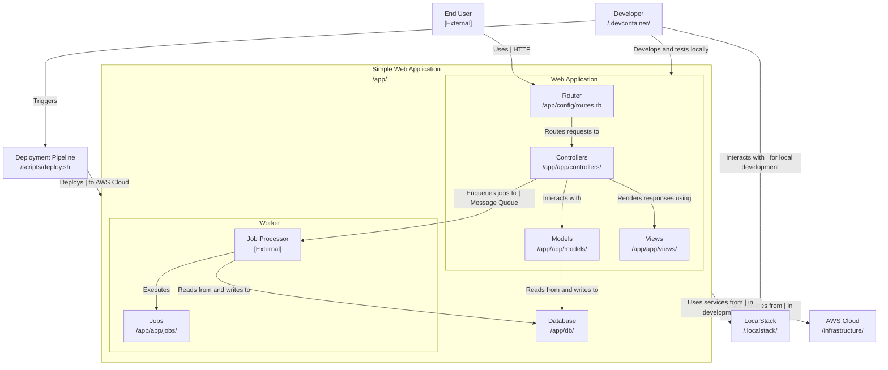

# Unnamed CodeViz Diagram

```mermaid
graph TD

    user["End User<br>[External]"]
    developer["Developer<br>/.devcontainer/"]
    localstack["LocalStack<br>/.localstack/"]
    aws["AWS Cloud<br>/infrastructure/"]
    deployment["Deployment Pipeline<br>/scripts/deploy.sh"]
    subgraph webapp_system_boundary["Simple Web Application<br>/app/"]
        database["Database<br>/app/db/"]
        subgraph web_app_container_boundary["Web Application<br>/app/"]
            router["Router<br>/app/config/routes.rb"]
            controllers["Controllers<br>/app/app/controllers/"]
            models["Models<br>/app/app/models/"]
            views["Views<br>/app/app/views/"]
            %% Edges at this level (grouped by source)
            router["Router<br>/app/config/routes.rb"] -->|"Routes requests to"| controllers["Controllers<br>/app/app/controllers/"]
            controllers["Controllers<br>/app/app/controllers/"] -->|"Interacts with"| models["Models<br>/app/app/models/"]
            controllers["Controllers<br>/app/app/controllers/"] -->|"Renders responses using"| views["Views<br>/app/app/views/"]
        end
        subgraph worker_container_boundary["Worker<br>/app/jobs/"]
            job_processor["Job Processor<br>[External]"]
            jobs["Jobs<br>/app/app/jobs/"]
            %% Edges at this level (grouped by source)
            job_processor["Job Processor<br>[External]"] -->|"Executes"| jobs["Jobs<br>/app/app/jobs/"]
        end
        %% Edges at this level (grouped by source)
        models["Models<br>/app/app/models/"] -->|"Reads from and writes to"| database["Database<br>/app/db/"]
        controllers["Controllers<br>/app/app/controllers/"] -->|"Enqueues jobs to | Message Queue"| job_processor["Job Processor<br>[External]"]
        job_processor["Job Processor<br>[External]"] -->|"Reads from and writes to"| database["Database<br>/app/db/"]
    end
    %% Edges at this level (grouped by source)
    user["End User<br>[External]"] -->|"Uses | HTTP"| router["Router<br>/app/config/routes.rb"]
    developer["Developer<br>/.devcontainer/"] -->|"Develops and tests locally"| web_app_container_boundary["Web Application<br>/app/"]
    developer["Developer<br>/.devcontainer/"] -->|"Interacts with | for local development"| localstack["LocalStack<br>/.localstack/"]
    developer["Developer<br>/.devcontainer/"] -->|"Triggers"| deployment["Deployment Pipeline<br>/scripts/deploy.sh"]
    deployment["Deployment Pipeline<br>/scripts/deploy.sh"] -->|"Deploys | to AWS Cloud"| webapp_system_boundary["Simple Web Application<br>/app/"]
    webapp_system_boundary["Simple Web Application<br>/app/"] -->|"Uses services from | in production"| aws["AWS Cloud<br>/infrastructure/"]
    webapp_system_boundary["Simple Web Application<br>/app/"] -->|"Uses services from | in development"| localstack["LocalStack<br>/.localstack/"]

```
---
*Generated by [CodeViz.ai](https://codeviz.ai) on 10/11/2025, 11:43:41 PM*
