## Rails application diagram (Graphviz DOT)

The diagram below shows the primary components discovered under `app/`: controllers, models, jobs, mailers, helpers, views, and assets. It's a high-level view — controllers point to models they commonly interact with; jobs and mailers also reference models.

```graphviz
digraph RailsApp {
  rankdir=LR;
  node [shape=rectangle, style=filled, fillcolor="#eef"];

  // Clients / Router
  Client [label="Client / Browser", shape=oval, fillcolor="#ffd"];
  Router [label="Rails Router", shape=diamond, fillcolor="#ffd"];

  // Controllers
  subgraph cluster_controllers {
    label = "Controllers";
    style=rounded;
    ApplicationController [label="ApplicationController", fillcolor="#bfe8ff"];
    // Derived controllers (examples)
    HealthController [label="rails/health#show", fillcolor="#bfe8ff"];
  }

  // Models
  subgraph cluster_models {
    label = "Models";
    style=rounded;
    ApplicationRecord [label="ApplicationRecord", fillcolor="#e8e8ff"];
    OtherModels [label="Other Models\n(User, Post, etc.)", fillcolor="#e8e8ff"];
  }

  // Jobs / Mailers / Helpers / Assets
  ApplicationJob [label="ApplicationJob", fillcolor="#efe8ff"];
  ApplicationMailer [label="ApplicationMailer", fillcolor="#efe8ff"];
  Helpers [label="Helpers", fillcolor="#e8ffef"];
  Views [label="Views (ERB/Haml/HTML)", fillcolor="#fff1e0"];
  Assets [label="Assets (JS/CSS/Images)", fillcolor="#fff1e0"];

  // Stimulus / JS controllers (example)
  StimulusController [label="Stimulus Controller\n(app/javascript/controllers)", fillcolor="#f0f8ff"];

  // Edges: request flow and relationships
  Client -> Router [label="HTTP request"];
  Router -> ApplicationController [label="dispatches to"];
  ApplicationController -> HealthController [label="action call", style=dashed];

  ApplicationController -> ApplicationRecord [label="uses / queries"];
  HealthController -> ApplicationRecord [label="reads / checks"];
  ApplicationController -> OtherModels [label="uses (User, Post...)", style=dotted];

  ApplicationJob -> OtherModels [label="operates on / queues"];
  ApplicationJob -> ApplicationRecord [label="may use"];
  ApplicationMailer -> OtherModels [label="sends emails about"];

  Views -> Helpers [label="uses"];
  Views -> Assets [label="includes"];
  ApplicationController -> Views [label="renders"];

  StimulusController -> Views [label="enhances"];

  // File links (note: Graphviz viewers may not support clickable links; these are for human reference)
  ApplicationController [URL="../app/controllers/application_controller.rb"];
  ApplicationRecord [URL="../app/models/application_record.rb"];
  ApplicationJob [URL="../app/jobs/application_job.rb"];
  ApplicationMailer [URL="../app/mailers/application_mailer.rb"];
  StimulusController [URL="../app/javascript/controllers/hello_controller.js"];

}
```

## Quick links

Files and folders referenced above (relative to this `app/docs` folder):

* Router / routes: [../config/routes.rb](../config/routes.rb)
* Controller: [../app/controllers/application_controller.rb](../app/controllers/application_controller.rb)
* Models: [../app/models](../app/models)
* Job: [../app/jobs/application_job.rb](../app/jobs/application_job.rb)
* Mailer: [../app/mailers/application_mailer.rb](../app/mailers/application_mailer.rb)
* Stimulus controller: [../app/javascript/controllers/hello_controller.js](../app/javascript/controllers/hello_controller.js)

---

Rendered notes

- This is a generated high-level diagram based on files present under `app/`.
- To render the DOT diagram locally, install Graphviz and run: `dot -Tpng grand_rails_diagram.md -o diagram.png` after extracting the code block, or use an editor extension that renders DOT inside Markdown.
