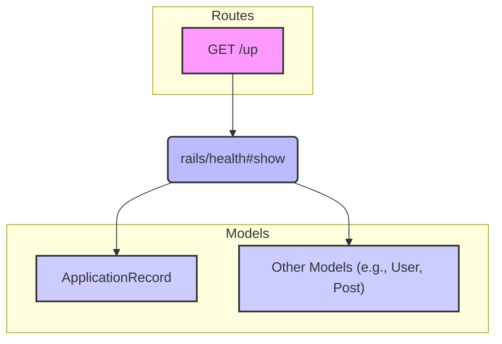

### Diagram Links:

*   **Routes:** [GET /up (app/config/routes.rb)](../config/routes.rb)
*   **Controller rails/health#show:** [app/app/controllers/application_controller.rb](../app/controllers/application_controller.rb)
*   **Model ApplicationRecord:** [app/app/models/application_record.rb](../app/models/application_record.rb)
*   **Models Folder:** [app/app/models](../app/models)
